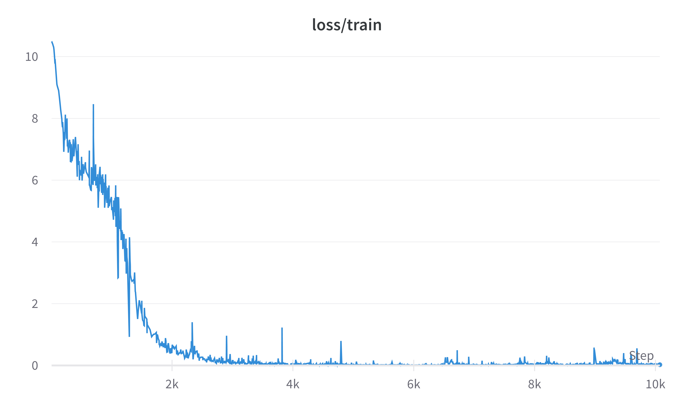

# PythonCoder

***PythonCoder*** is a code generation model only trained only on ***Python*** dataset ([codeparrot/codeparrot-clean](https://huggingface.co/datasets/codeparrot/codeparrot-clean)) . It is a custom model with context window of 1024 tokens and its architecture is based on OpenAI's **GPT2** with **MultiQuery Attention** and **FlashAttention** (MultiHead Attention is also available as option).

It is **not** a commercial code-gen model instead made for ***educative purpose*** to demonstrate how each aspect is implemented and combined using **PyTorch** to build and train a *GPT like code-gen* model.

*Checkpoint weights, trained till 10K steps with 6 decoder layers can be found here* [Google drive](https://drive.google.com/file/d/1QpBwTMqeHRIkFOIL3ZMSIAt05Qt1Z6Fn/view?usp=sharing)

> Note: Current custom implementation of [***FlashAttention***](https://github.com/practice404/Research-Papers/tree/main/FlashAttention) is pretty slow, so as I found a way to make it vectorized, will integrate it to the architecture and update here 😅


## Usage:

```bash
$ pip install -r requirements.txt
```

### Text Completion:

```python
import torch
from transformers import AutoTokenizer, AutoConfig
from gpt2 import GPT2CasualLM, GPT2Config
from generate import generate


model_ckpt = "rootacess/FlashCoder"
tokenizer = AutoTokenizer.from_pretrained(model_ckpt)
tokenizer.add_tokens('<pad>')
tokenizer.pad_token = "<pad>"

model_config = AutoConfig.from_pretrained("gpt2",
                                          vocab_size=len(tokenizer),
                                          pad_token_id=tokenizer.pad_token_id,
                                          max_length=1024,
                                          n_layer=6).to_dict()
config = GPT2Config(**model_config)
model = GPT2CasualLM(config)

# loading from a checkpoint
# get the checkpoint till 10k steps from here:
# https://drive.google.com/file/d/1QpBwTMqeHRIkFOIL3ZMSIAt05Qt1Z6Fn/view?usp=sharing

checkpoint = "path of downloaded checkpoint.bin"
model.load_state_dict(torch.load(checkpoint, map_location=torch.device('cpu')))

# generating text:
text = '''def hello():
# print hello
'''

op = generate(text, config, tokenizer, checkpoint=checkpoint, top_k=1, top_p=0.9, temperature=0.2)
print(op['generated_text'])

```

### Training:

Current Model is trained on the [codeparrot/codeparrot-clean](https://huggingface.co/datasets/codeparrot/codeparrot-clean) dataset.

- Change the `train_config` and `model_config` like *n_layers=12*, etc which controls the training and model's parameters respectively inside `train.py`.

- Login to `wandb` and `huggingface_hub` using:

  - ```bash
    $ wandb login
    ```

  - ```bash
    $ huggingface-cli login
    ```

- ```bash
  $ python train.py
  ```



> Demo on Hugging Face spaces will be uploaded soon 
